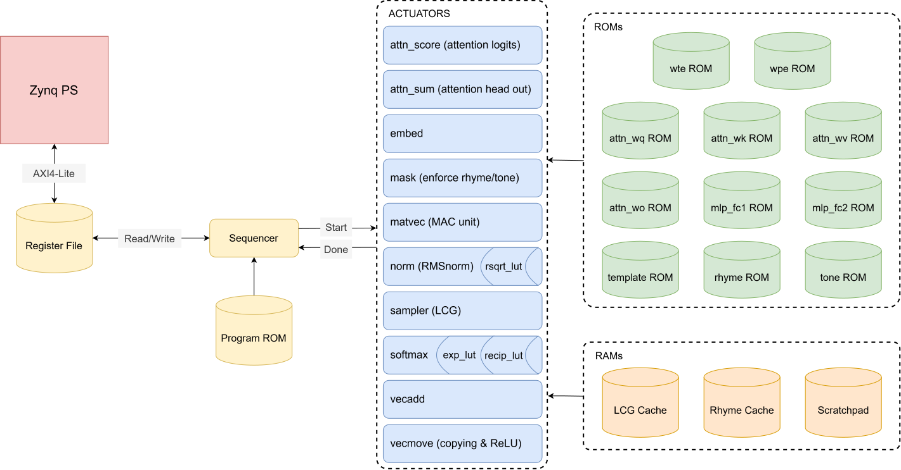

# MicroPoetry

This projects extends Andrej Karpathy's **[microgpt](https://karpathy.github.io/2026/02/12/microgpt/)** and Fabio Guzman's **[gateGPT](https://github.com/fguzman82/gateGPT/tree/main)** by building a hardware-accelerated GPT model for classical Chinese poetry. 
We target specifically at the 七言律诗 (seven-character regulated verse) format, where a poem contains 8 lines, with each line containing 7 characters. 
The main goal of the project is to build an inference engine in RTL for the quantized transformer model, implemented on a Xilinx Zynq-7020 FPGA. 

## Hardware

The hardware architecture is inspired by Fabio Guzman's **[gateGPT](https://github.com/fguzman82/gateGPT/tree/main)**. The PS side initiates the poem generation by sending over the poem title, LCG random seed, and which template to use. The sequencer reads the information from the register file and starts the actuators, one at a time. The entire sequence is encoded in a program generated from [Python code](./hardware/sequencer/program.py). 



| Actuator | Explanation |
|--------|-------------|
|`attn_score`| `q`, `k` dot product to compute `attn_logits` |
|`attn_sum`| `attn_weights`, `v` dot product to compute `head_out` |
|`embed`| token & position embedding lookup & addition |
|`mask`| apply tone and rhyme constraints based on template entry |
|`matvec`| matrix-vector multiplication unit for `linear()` |
|`norm`| `rmsnorm()` using LUT + 1 Newton-Raphson iteration for reciprocal square root|
|`sampler`| LCG for random sampling to get output token|
|`softmax`| `softmax()` using LUT + interpolation for `exp()` and for division by total|
|`vecadd`| vector addition |
|`vecmove`| copying vector to a different address; computing ReLU |

The ROMs are mostly dual-port for storing weights, templates, rhyme groups, and tone groups. The LCG cache stores and updates the LCG state. The rhyme cache stores the rhyme group, previous rhyming characters and tracks the generated tokens. The scratchpad is a dual-port RAM that stores the KV cache and activations in-progress. 

Results are verified against a bit-exact [Python model](./quantization/golden_model.py).

## Model

The model is modified from Andrej Karpathy's **[microgpt](https://karpathy.github.io/2026/02/12/microgpt/)** to pump the parameter size up. The training data contains 68968 poems from Tang and Song dynasties, all in the format of 七言律诗 (seven-character regulated verse). The vocabulary consists of the top 3000 most frequent characters along with several special tokens. 

| Parameter | Value | Explanation |
|-----------|-------|-------------|
| Vocabulary Size | 3005 | 3000 most frequent characters + `<UNK>`, `<BOS>`, `<EOS>`, `<SEP>`, and `<PAD>` |
| `n_embd` | 64 | Embedding dimension |
| `n_head` | 4 | Number of attention heads |
| `n_layer` | 4 | Number of transformer layers |
| `block_size` | 96 | Maximum sequence length (title + body + special tokens, with margin) |
| Parameter Size | 395,702 | Total number of trainable parameters |
| Weight Tying | On | Input token embedding weights tied to LM head weights |

Inference remains sequential with the following constraints applied:

- The tone (平仄) of the characters must satisfy the [tonal patterns](./model/Data/templates.json) of 七言律诗 (seven-character regulated verse).
- The characters that rhyme must belong to the same 平水韵 (Ping Shui Yun) [rhyme group](./model/Data/rhyme_table.json).

The rhyming characters are restricted not to repeat, and repetition in general is penalized. For a user-provided title, the model will generate a poem with relevant content. The script is available on [Google Colab](https://colab.research.google.com/drive/1t-YuAHcHE9ubuFYf_acDLS3uS68gfpKT?usp=sharing).

## Quantization

To reduce computation cost and memory footprint, the model [weights](./quantization/weight_quantization.ipynb) are quantized to `INT8` per-tensor, along with the [activations](./quantization/activation_quantization.ipynb). The table shows the impact of quantization on model loss.

| Quantization Scheme | Validation Loss |
|---------------------|-----------------|
| FP32 weights, FP32 activations | ~4.821 |
| INT8 weights, FP32 activations | ~4.826 |
| INT8 weights, INT8 activations | ~4.935 |

The numbers are for estimations only and may vary with different validation sets. At each quantization boundary, the activations are rescaled using an integer multiply + right shift pair `(M, S)` such that `rescaled_activation ≈ (raw_value x M) >> S`. The scaling constants are calculated [here](./quantization/scaling.py). 

## Performance

| Iteration | Description | Token/s | Frequency | LUT | Registers | BRAM | DSP |
|-----------|-------------|---------|-----------|-----|-----------|------|-----|
| 0 | First core | ~212 | 50 MHz | 8066 | 2549 | 112 | 27 |
| 1 | Timing rework | ~386 | 100 MHz | 7421 | 2786 | 112 | 34 |

## Usage

To assemble the Vivado project:
```tcl
vivado -source .\MicroPoetry\create_project.tcl
```

To assemble the Vitis project:
1. Create a standalone platform against `.\MicroPoetry\poem_wrapper.xsa`
2. Add files `.\MicroPoetry\app\src\main.c` and `token_id.h` to source

## Acknowledgments

This project builds on:

- **[microgpt](https://karpathy.github.io/2026/02/12/microgpt/)** by Andrej Karpathy — the minimal, dependency-free GPT implementation that this project's architecture is derived from.
- **[gateGPT](https://github.com/fguzman82/gateGPT/tree/main)** by fguzman82 — an RTL implmenentation of microgpt running on Vertex-5 FPGA, referenced for architectural inspiration.
- **[chinese-poetry](https://github.com/chinese-poetry/chinese-poetry)** by jackeyGao — the Tang and Song poetry corpus (全唐诗, 全宋诗) used for training data.
- **[chinese_word_rhyme](https://github.com/charlesix59/chinese_word_rhyme)** by charlesix59 — 平水韵 rhyme category and tone (平仄) reference tables used for structural constraints.

See [LICENSE](LICENSE) and individual source repos for their respective licensing terms.
